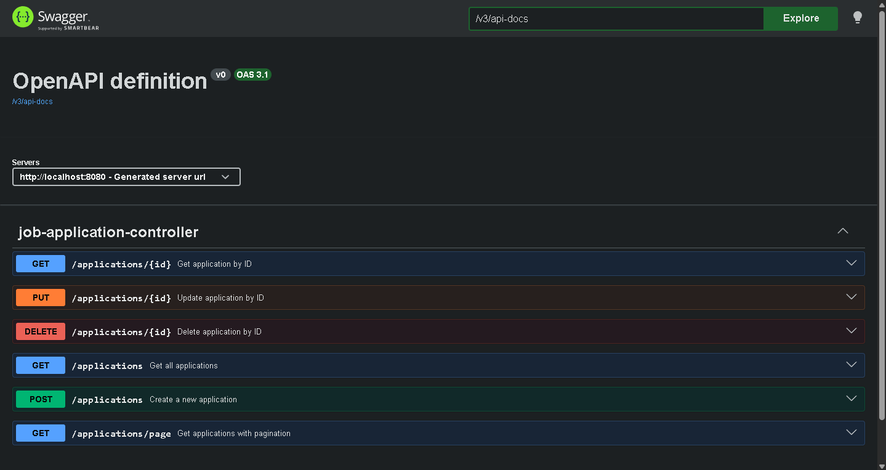
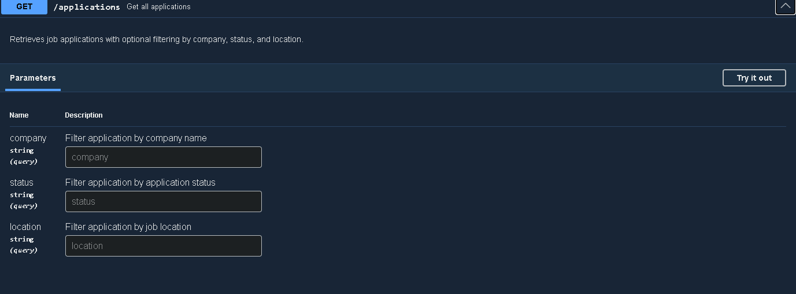
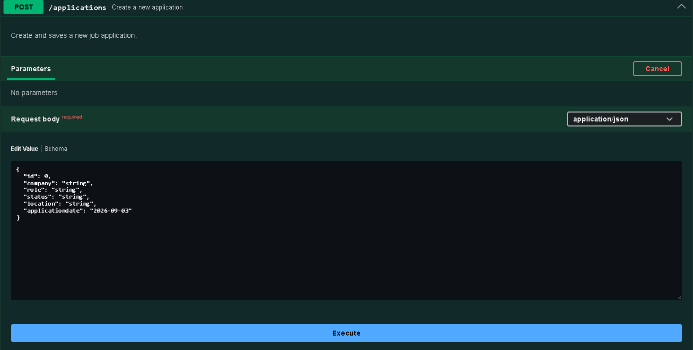
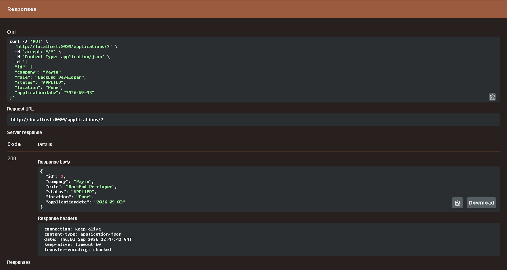

# Job Application Tracker

A Spring Boot REST API for managing and tracking job applications with CRUD operations, filtering, pagination, validation, global exception handling, and JWT-based authentication and authorization.

## 🎯 Project Overview

The Job Application Tracker is a backend application built to manage job application records through a RESTful API.

The project was developed as a practical backend learning project, focusing on real-world development concepts such as layered architecture, DTOs, validation, database persistence, API design, exception handling, filtering, pagination, authentication, authorization, and JWT-based security.

The application provides secure authentication using Spring Security and JWT while keeping the job application management APIs protected.

## 🛠️ Tech Stack

* **Language:** Java 21
* **Framework:** Spring Boot
* **Security:** Spring Security
* **Authentication:** JWT
* **Password Hashing:** BCrypt
* **Persistence:** Spring Data JPA
* **Database:** MySQL
* **Build Tool:** Maven
* **API Documentation:** Swagger UI / OpenAPI
* **API Style:** REST
* **Version Control:** Git & GitHub

## ✨ Features

### Job Application Management

* Create new job applications
* Retrieve all job applications
* Retrieve a job application by ID
* Update existing job applications
* Delete job applications
* Search and filter applications
* Filter by company
* Filter by application status
* Filter by location
* Combine multiple filters
* Pagination support

### Validation & Error Handling

* Request validation using DTOs
* Global exception handling
* Meaningful validation error responses
* Proper HTTP status codes
* Consistent RESTful error responses

### Authentication & Security

* User registration
* Secure password hashing using BCrypt
* User login with Spring Security
* JWT token generation
* JWT token expiration
* JWT token validation
* JWT-based stateless authentication
* Role information stored inside JWT
* Role-based authorization support
* Protected application endpoints
* Invalid and expired JWT requests return `401 Unauthorized`
* JWT secret configured through environment variables

### API Documentation

* Interactive Swagger UI
* OpenAPI specification
* API testing through Swagger UI

## 🏗️ Application Structure

The application follows a layered backend architecture:

```text
Controller
    ↓
Service
    ↓
Repository
    ↓
Database
```

### Security Architecture

Authentication and authorization are implemented using Spring Security and JWT:

```text
Client
   ↓
AuthController
   ↓
AuthenticationManager
   ↓
DaoAuthenticationProvider
   ↓
CustomUserDetailsService
   ↓
UserRepository
   ↓
MySQL
   ↓
BCrypt Password Verification
   ↓
JWT Generation
   ↓
Client
```

For protected requests:

```text
Client
   ↓
Authorization: Bearer <JWT>
   ↓
JwtFilter
   ↓
JWT Validation
   ↓
Extract Username + Role
   ↓
SecurityContext
   ↓
Spring Security Authorization
   ↓
Protected Controller
   ↓
Service
   ↓
Repository
   ↓
MySQL
```

### Main Components

* **Controller Layer** — Handles HTTP requests and API endpoints.
* **Service Layer** — Contains application and business logic.
* **Repository Layer** — Handles database operations using Spring Data JPA.
* **DTOs** — Separate API request/response models from database entities.
* **Security Configuration** — Defines authentication and authorization rules.
* **JwtService** — Generates and extracts information from JWT tokens.
* **JwtFilter** — Intercepts requests and validates JWT authentication.
* **CustomUserDetailsService** — Loads user information from the database for Spring Security.
* **PasswordEncoder** — Uses BCrypt to securely hash and verify passwords.
* **Exception Handling** — Provides consistent error responses across the API.
* **Validation** — Validates incoming request data before processing.

## 🔐 Authentication Flow

### User Registration

```text
POST /auth/register
        ↓
AuthController
        ↓
AuthService
        ↓
BCrypt PasswordEncoder
        ↓
Password Hash
        ↓
UserRepository
        ↓
MySQL
```

The original password is never stored directly. It is converted into a BCrypt hash before being saved.

The registration endpoint returns only the user's ID and username rather than exposing the stored password hash.

### User Login

```text
POST /auth/login
        ↓
AuthenticationManager
        ↓
DaoAuthenticationProvider
        ↓
CustomUserDetailsService
        ↓
UserRepository
        ↓
MySQL
        ↓
BCrypt Password Verification
        ↓
Authentication
        ↓
JWT Generation
        ↓
AuthResponse
```

The login response contains:

```json
{
  "token": "JWT_TOKEN",
  "username": "username",
  "role": "USER"
}
```

### Protected Request

The client sends the JWT using:

```text
Authorization: Bearer <JWT>
```

The `JwtFilter` extracts and validates the token before the request reaches protected controllers.

## 🔌 API Endpoints

### Authentication

| Method | Endpoint         | Description                        |
| ------ | ---------------- | ---------------------------------- |
| POST   | `/auth/register` | Register a new user                |
| POST   | `/auth/login`    | Authenticate user and generate JWT |

### Job Applications

| Method | Endpoint             | Description                                  |
| ------ | -------------------- | -------------------------------------------- |
| GET    | `/applications`      | Get all applications with optional filtering |
| GET    | `/applications/{id}` | Get an application by ID                     |
| POST   | `/applications`      | Create a new application                     |
| PUT    | `/applications/{id}` | Update an application by ID                  |
| DELETE | `/applications/{id}` | Delete an application by ID                  |
| GET    | `/applications/page` | Get applications with pagination             |

> **Note:** Job application endpoints require a valid JWT.

## 🔎 Filtering

The application supports filtering job applications by:

* Company
* Status
* Location
* Multiple filtering criteria together

Pagination can also be used when retrieving application records.

## 📖 API Documentation

The API is documented using **Swagger UI** and **OpenAPI**.

Swagger UI provides an interactive interface to explore and test the available REST API endpoints.

### Swagger UI

Run the application locally and open:

```text
http://localhost:8080/swagger-ui/index.html
```

### OpenAPI Specification

The OpenAPI specification is available locally at:

```text
http://localhost:8080/v3/api-docs
```

> **Note:** These URLs use localhost, so they are accessible only when the application is running on your local machine.

## 🗄️ Database

The application uses **MySQL** for persistent storage and **Spring Data JPA** for database interaction.

The project contains separate data models for:

* Users
* Job applications

Passwords are stored as BCrypt hashes rather than plain text.

Application data is accessed through the repository layer.

## ▶️ How to Run

### Prerequisites

Make sure you have the following installed:

* Java 21
* Maven
* MySQL

### 1. Clone the repository

```bash
git clone https://github.com/Nithushan5566/JobApplication-Tracker.git
```

### 2. Create the MySQL database

Create a database for the application in MySQL.

### 3. Configure the application

Update:

```text
src/main/resources/application.properties
```

The application expects the following environment variables:

```text
DB_USERNAME
DB_PASSWORD
JWT_SECRET
```

Example:

```text
DB_USERNAME=your_database_username
DB_PASSWORD=your_database_password
JWT_SECRET=your_long_secure_secret
```

> **Important:** Do not commit actual database credentials or JWT secrets to GitHub.

### 4. Run the application

Using Maven:

```bash
./mvnw spring-boot:run
```

On Windows:

```bash
mvnw.cmd spring-boot:run
```

The application will start on:

```text
http://localhost:8080
```

## 🧠 What I Learned

This project helped me move beyond basic CRUD development and understand how a real backend application can be structured and secured.

Through this project, I worked with:

* Java and Spring Boot
* REST API design
* Layered architecture
* Controller-Service-Repository pattern
* DTOs and data validation
* Spring Data JPA
* MySQL database integration
* CRUD operations
* Filtering and pagination
* Global exception handling
* Consistent API responses
* Swagger / OpenAPI documentation
* Spring Security
* Authentication and authorization
* BCrypt password hashing
* `UserDetailsService`
* `DaoAuthenticationProvider`
* `AuthenticationManager`
* JWT generation and validation
* JWT expiration
* JWT filters
* Security context
* Role-based authorization
* Stateless authentication
* Environment-based secret configuration
* Git and GitHub workflow

## 🚀 Future Improvements

This project is part of my ongoing learning journey.

Some areas I plan to explore next include:

* OAuth2 authentication with Google
* OAuth2 authentication with GitHub
* Improving role-based authorization
* Adding a frontend for the API
* Deploying the application to the cloud
* Improving test coverage
* Adding additional backend features
* Exploring additional backend and deployment technologies


## Screenshots

### Swagger UI

Interactive API documentation and testing interface.



### Get Applications with Filtering



### Create Application



### Update Application




